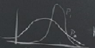
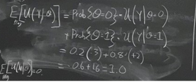
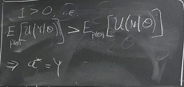

# Session 1:

## Goal of this course:

The focus of this course is to create a decision tool for your research. In this course, we learn how to take machine learning tools and statistics, and make decisions based on them.

## Example: 
There was a group of atmospheric scientists and their goal was to collect data from certain kinds of weather information. To collect data, they had flight planes. They only had limited flight hours in their budget and they only had so many days in the field season. They had to make a decision about when to launch their plane, use of the specific amount of the flight hours, and where to send it to get better possible data collection. They had to make decisions about in which days, they needed to launch the flight or in which locations, such as “A”, “B”, etc. In this case, they had forecasting models and a lot of information but they lacked the efficient way to make sense of complex information and boiled it down when they had to fly their plane and where.

Sometimes you have too much information and it may overwhelm you and you need to boil it down, and connect it to the decision you have to make.

The framework, which we use is the framework of the statistical decision theory.
## Framework of the statistical decision theory:

States of the word $\theta \in \Theta$  

It is the state, which is unknown and we have some information about it but it is imperfect.

Example:  $\Theta = \{0,1\}$  

0: The weather condition is not good for the collection of data

1: The weather condition is good for the collection of data

We have beliefs about $\theta$ which can be represented by using probability distribution over $\theta$.  $p(\theta)$  

If $\theta$  gets just two values, including, zero and one"
 
 \begin{equation}
  \begin{array}{l}
    \Theta=\{0,1\} \\ 
     p(\theta)=prob\{{\theta=1}\}
  \end{array}
\end{equation}
 
 
There are actions that can be taken:

Actions:

$a \in A$ , A is a set of options

For example, it can be about giving a certain drug to the patient or it can be about flying the plane or not

Example 1: A={give medication, don't}

Example 2: A={fly the plane, don’t}

 
We have some kinds of predictive models which somehow are going to help us to improve or sharpen the probability distribution over $\theta$.  $(P_{0}(\theta)=>P_{1}(\theta))$
 
 
 
$P_{0}$ is the decision-maker beliefs about $\theta$

$P_{1}$ it is the improved or sharpened the probability distribution over $\theta$ by using the predictive models

There are some kinds of payoff functions or loss functions which are the function of the taken action and the state of the art.  

Example: $U(a, \theta)$

Example: Give a meditation (antibiotic) to the patient who may or may not have a particular disease (viral or bacterial). If the disease is the bacterial one, then giving the antibiotic will be helpful; otherwise not only does not it helpful but also it will reduce his resistance to antibiotics (It will have a negative impact).

$\theta$ => 0: The patient does not have a bacterial infection            1: The patient has a bacterial infection 

Actions => Yes: Give the meditation       No: Do not give the patient the meditation     

We can calculate the average pay off per each action which was shown in the table

 |               | 0             |      1       | Average      |
 | ------------- | ------------- |------------- |------------- |
 |       Yes     | -3            |2             |   1          |
 |       No      | 0             |0             |    0         |

 
As the calculated average pay off related to action “No” is bigger than action “Yes”, the action “No” will be selected.

Suppose: $prob\{\theta=1\}=0.8$
 

Suppose further our decision procedure calls for maximizing expected payoff. Then, the expected value for each action can be calculated as follows:
 
 

 
 
Then, the expected payoff of action “yes” is bigger than action “no”.

Some people may try to minimize the worse loss instead of maximizing the expected payoff. They may try to avoid the worse outcome. 

Example: there is a game and if you many play it or not. If you win, you will get $200,000; otherwise, you will lose $300,000. Losing $300,000 is high and it would be rational for someone not to use maximization expected payoff in this situation. Someone may have a background attitude toward the risk. Then, it may be advisable for one not to maximize the expected value.

 |               | 0             |      1       | Average      |
 | ------------- | ------------- |------------- |------------- |
 |       Yes     |  -300,000     |200,000       |   100,000    |
 |       No      | 0             |0             |    0         |

Where do these beliefs come from?

If you have priority information/background knowledge, it can help to have sharpened beliefs. 

