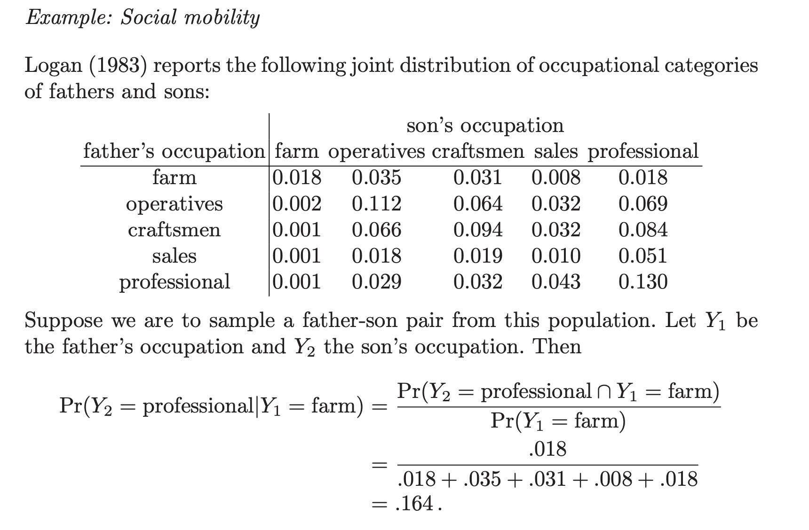
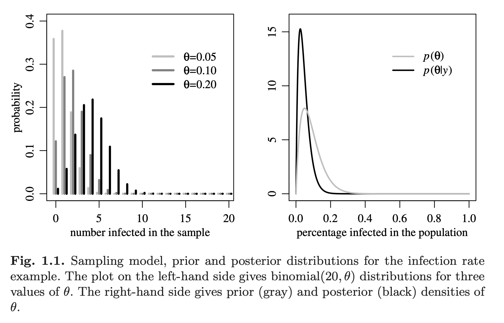
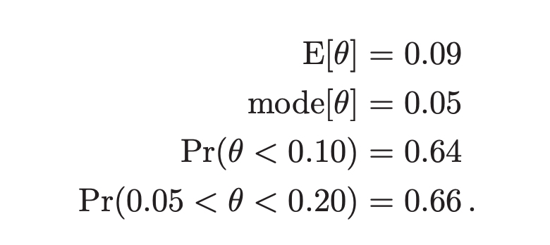

# Session 11

Example: We have the population of the fathers and sons and their occupation are divided into the five categories. The numbers in the table shows the joined probability distribution. Also, the sum of the all numbers in the table equals to one. 

Two variables are independent if knowing one of them doen not give you information about the other one. Also, two variables are independent if the following relationship is trup between them:

$P(A\capB)=P(A)\timesP(B)$

What is the probability that the son is professional?

$Pr(Y_{2}=Professional)=\sigma Pr(Y_{2}=Professional,Y_{2}=i)=0.352	\neq0.164$

It is shown that the conditional probability is not equal to unconditional probability.

THe above concept is essentially what your predictive model is going to do. You are going to go from unconditional probability to conditional probability. You are going to condition on some data you have to give the probability of some future event. There are different way to create thiese joined probability events such as machine learning and so on. But essentially what you are going to do is to built somehow the joined probability distributions between the data that yu know about (Prior knowledge) and the data you want to know about.

### Bayesian methods: Introduction via simple example

Suppose you want to estimate the fraction of a population that is infected with some disease.

$\theta \in [0,1]$ : true value

Test a random sample of $20$ from the population. 

$Y \in \{0,1,\ldots,20\}$ : # of positive results.

Question: What does realized value of $Y$ tell us about the true value of $\theta$?

### Sampling model

$Y | \theta$ ~ binomial$(20,\theta)$: For $y = 0, 1, \ldots, 20$, (i.i.d.)

$$l(y|\theta) = \Pr(Y=y | \theta) = {20 \choose y} \theta^y (1-\theta)^{(20-y)}$$

where $\binom{n}{k} = \frac{n!}{k!(n-k)!}$

$l(y|\theta)$ called the *likelihood function*.

The above left graph is the graph of the likelihood function or the histrogram of the likelihood function for different values of data. If $\theta$ is equal to 0.05, there is a substantial probability of getting zero successful tasks out of 20 and if you get zero success out of 20 that just not tell you  the expected value for the real $\theta$ is zero. 

Idea: For any $0< \theta < 1$, all values of $Y$ are *possible*, but some are more likely than others. 

The likelihood function tells us how likely is each possible observation, for a given $\theta$.

If, say, $Y = 15$, that provides evidence that $\theta$ is not small.

Core of Bayesian reasoning: work out all the different combinations of $Y, \theta$ that could have generated the observed sample data. 

### Prior information

Suppose we have some background knowledge about the likely values of $\theta$. 

Represent this knowledge by means of a *prior distribution* $\pi(\theta)$ over $[0,1]$.

Obviously, there are many (infinitely many) possible such distributions. 

For convenience, we typically choose to model priors as chosen from a parametrized family of distributions.

### The Beta distribution

$$\theta \sim \text{beta}(a,b)$$

Then

$$E[\theta] = \frac{a}{a+b}$$

###

For our case, let's suppose our prior beliefs correspond to:

$$\theta \sim \text{beta}(2,20)$$

###

$$\theta \sim \text{beta}(2,20)$$ 

implies

