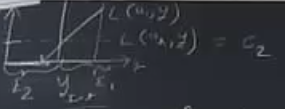
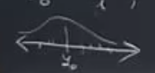
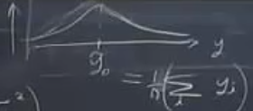

# Session 12

# The decision problem

A pub owner in Charlottesville plans to sell beer outside on St. Patrick's Day, March 17. The pub owner must decide whether to arrange to rent a supplemental refrigeration system for the day. 

Supplemental refrigeration offers a form of insurance. If temperatures outside on March 17 are high and the pub owner has not arranged supplemental refrigeration, she will be left with warm beer that she will have difficulty selling, leading to financial losses. Conversely, if she pays for supplemental refrigeration when temperatures are low, she will have incurred an unnecessary expense.

The analysis here uses statistical decision theory to generate a recommendation about whether or not to pay to rent a supplemental refrigeration system, in order to insure against the potential of financial losses in case of high temperatures.

# Formalism

## Action set

The action set $\mathbb{A}$ includes just two elements: $\mathbb{A} = \{a_1, a_2\}$, where $a_1$ and $a_2$ correspond to the decisions to not purchase insurance, and to purchase insurance, respectively.

## Payoffs: The loss function

Let $L(a,y)$ denote the losses incurred by the publican. These depend on the action chosen, and on $y$, the high temperature in Charlottesville on March 17, measured in degrees Celsius. 

Suppose we have two possible actions $a \in {a_{1},a_{2}}$, and we want to predict the weather temperature $y_{n+1}$, and based on that we want to decide about the two following actions. 

The payoff only depends on the true value of some $L(a,y_{n+1})$

$a_{1}$: not purchase insurance

$a_{2}$: purchase insurance

Historical data on $y=y_{1},y_{2},...,y_{n}$. This is the history of the temperature in this example.

We want:

* probabilistic forecast of $y_{n+1}$

* use prediction to choose optimal $a^{*}$

What to do?

We want the probabilistic forecast; we want to know the distribution probability for $y_{n+1}$. 

Sometimes the payoff is not symmetric. If the temperature is high, the loss is high. If the temperature is low, the loss is low.

Based on the loss function which action should be chosen?

$\hat{L_{emp}}=\frac{\sum_{i=1}^{n} (a_{1},y_{i})}{n}$

Define events:

$E_{1}=\{y|y_{n+1}	\le y_{int}\}$   $a^{*}=a_{1}$    

$E_{2}=\{y|y_{n+1}\ge y_{int}\}$     $a^{*}=a_{2}$  

Want $Pr\{E_{1}\}=Pr\{y \le y_{int}\}=\frac{1}{n}\sum_{y \le y_{int}} (1)$ Estimate of $Pr(E_{1})$

If $\hat{L_{emp}} \ge c_{2}$, then $a^{*}=a_{2}$

Need some model of the data generating process

$y_{i}=y_{0}+	\varepsilon_{i},\varepsilon_{i}\sim N(0,\sigma^{2}_{y})$

Here, the mean and variance are unknown.  

Equivalently $y_{i} \sim N(y_{i},\sigma^{2}_{y})$

We need to find the distribution of the losses over the different actions. To do that, we need the distribution of the $y$

Want the probability forecast of $y_{n+1}$

To get it, estimate the $y_{0},\sigma^{2}_{y}$ from $y_{1},y_{2},...,y_{n}$

There are multiple ways to do that.

Standard approach: OLS

mean: $min_{\hat{y_{0}}}\sum(\hat{y_{0}}-y_{i})^{2}=\sum(\hat{\varepsilon_{i}}^{2})$

So, we will get the $y_{0},\sigma^{2}_{y}$

This is the distribution y. This describes the probability forecast over the nest value of y. Using it, we can get the probability forecast for losses.

Suppose, you plot your estimated errors $\hat{varepsilon_{i}}=y_{i}-\hat{y_{0}}$

The variance of the error tends to be growing. It violates the assumption of the independent identically distribution. This is called the heteroskedasticity. 
When you work with data, you need to look at your data. 
In overall, if heteroskedasticity happens, we would have the wrong estimate of probabilities.

