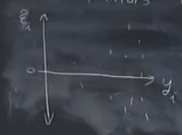
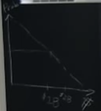
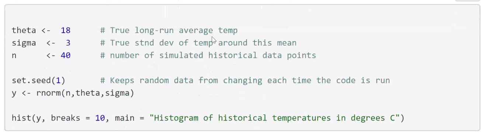
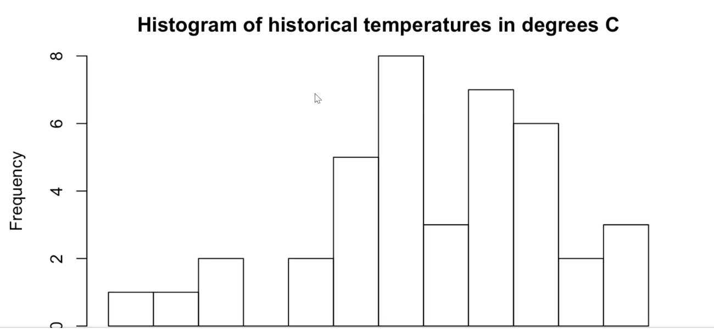
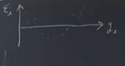
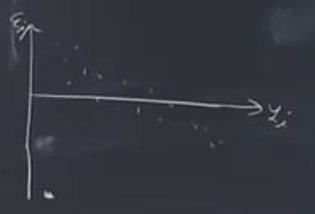

# Session 13

# The decision problem

A pub owner in Charlottesville plans to sell beer outside on St. Patrick's Day, March 17. The pub owner must decide whether to arrange to rent a supplemental refrigeration system for the day. 

Supplemental refrigeration offers a form of insurance. If temperatures outside on March 17 are high and the pub owner has not arranged supplemental refrigeration, she will be left with warm beer that she will have difficulty selling, leading to financial losses. Conversely, if she pays for supplemental refrigeration when temperatures are low, she will have incurred an unnecessary expense.

The analysis here uses statistical decision theory to generate a recommendation about whether or not to pay to rent a supplemental refrigeration system, in order to insure against the potential of financial losses in case of high temperatures.

# Formalism

## Action set

The action set $\mathbb{A}$ includes just two elements: $\mathbb{A} = \{a_1, a_2\}$, where $a_1$ and $a_2$ correspond to the decisions to not purchase insurance, and to purchase insurance, respectively.

## Payoffs: The loss function

Let $L(a,y)$ denote the losses incurred by the publican. These depend on the action chosen, and on $y$, the high temperature in Charlottesville on March 17, measured in degrees Celsius. 

If temperature risks are uninsured ($a = a_1$), losses increase linearly with temperature for temperatures above a threshold level $\underline{y}$: 
if $y > \underline{y}$,

$$ L(a_1,y) =   \left\{
\begin{array}{ll}
      0                     & y \leq \underline{y} \\
      c_1 (y-\underline{y}) & y > \underline{y} \\
\end{array} 
\right.  $$

for some constant $c_1 > 0$.

## Uncertainty

Arrangements to arrange supplemental refrigeration must be locked in two weeks in advance, before temperatures are known. Let $Y$ denote the random temperature.

## Decision criterion

The pub owner is risk-neutral. Her decision criterion is: choose the action that minimizes losses in expectation:

$$ a^* = \underset{a \in \mathbb{A}}{\operatorname{argmin}}{\,} E[L(a,Y)]$$
where the expectation is taken over the distribution of $Y$. This distribution represents the information about uncertain temperatures that the decision-maker has available at the time of she must make her decision.

To operationalize this model and derive an optimal solution requires building a system for generating a probabilistic forecast for temperatures on March 17.

# Statistical forecasting model

At a two-week time, horizon, temperature forecasts based on numerical weather prediction models are not reliable. Instead, a statistical forecasting model is used.

## Historical data

Let $y_1, \ldots, y_n$ denote the high temperature in Charlottesville on March 17 for each of the previous $n$ years.

## Model of the data generating process

It is supposed that these data were generated as independent, identically distributed random draws from a normal distribution: for $i = 1, \ldots, n$,

$$y_i = \theta + \varepsilon_i$$
where $\theta$ denotes the true but unobserved value of the long-run average temperature, and where $\varepsilon_i \sim N(0, \sigma^2_\varepsilon)$. 

## Comments on this statistical model: The risk of model mis-specification

This model asserts several substantive assumptions about the data generating process.

  * The process is assumed to be *stationary*. There is no upward trend over time, no long-term climate change, etc.
  
  * Temperatures are assumed to be *independent* from one year to the next. In particular, there is no *autocorrelation*. Knowing that one year's temperature was unusually high (say) provides no information about the likelihood that next year's temperature will also be unusually high. Inter-annual climate cycles (e.g., due to $El\ Ni\tilde{n}o$) are ruled out.
  
  * Temperature variations around the long-run average are assumed to be *identically distributed*. This assumption rules out the possibility that variance is, say, greater when temperatures are higher than when they are lower.
  

In the above graph, this above assumption is not supportive. You are underestimating the risk of very high temperature. Systematically, you are underestimating the probability of the very large loss. It will lead to the wrong recommendation.
  

This graph shows that for each amount of the loss what is the probability of getting that amount of the damage of loss. It is the summery picture of tail risk. It is not the probability of each level; it is the probability of exceeding any given total loss level.

And others.

In general, it is important to formulate a statistical model that accurately reflects the true characteristics of the underlying data generating process.

When your statistical model is mis-specified, your probabilistic forecast of future events is likely to stray from the true underlying probabilities. Model mis-specification can then lead to inaccurate estimates of the distribution of losses for each possible action. This error may in turn lead to selection of a sub-optimal action.

A particular problem to guard against is the possibility to underestimate the likelihood of extreme events that could cause catastrophic losses. 

That said, your time on this Earth is limited. Depending on the decision problem and the stakes involved, refining your model to get sharper loss estimates may or may not be worth the bother.

A reasonable approach is to start by first writing down a simple forecasting model that appears to capture the essence of the process as you understand it. On the basis of this simple model, generate first-cut probabilistic forecasts of uncertain events. Use these to generate estimated distributions of losses for each possible action in your action set. On that basis, use the specified decision criterion to derive an initial optimal decision rule.

Then, go back and check things over more carefully. Review the realism of your statistical model, given your understanding of data generating process. Plot and examine the distribution of your prediction errors. Do your prediction errors appear to follow a pattern that matches what you would expect, given the assumptions you have made? 

If you find evidence that your prediction model is mis-specified, it may be worth it to go back and refine your model, and see if you generate different results.

One very good idea is to perform a *sensitivity analysis*. How sensitive are your decision recommendations and outcomes to the assumptions you've built into your statistical model? If you are not highly confident in your statistical assumptions, and if those assumptions turn out to matter a lot for your recommendations and outcomes, then it could very well be worth the bother to revisit those assumptions, and investigate alternatives.

On the other hand, if your decision recommendations are not highly sensitive to your statistical assumptions, then keeping your initial model may be defensible. The point of this work is *not* to build the best possible prediction system, bullet-proof against any statistical criticism. The point is to help people make good decisions -- or at least, decisions better than they would have made otherwise. Your time and other resources are limited. A good-enough model may be good enough.

## Simulation of the prediction process, no covariates

$y_{i}=\theta+\varepsilon_{i}$

$\hat{\theta}=\frac{1}{n}\sum y_{i}=\bar{y}$

$\varepsilon_{i}=y_{i}-\bar{y}$

Suppose that your errors are kind of like the following shape

There is another variable that we have not consider it. There is missing variable.

$y_{i}=\beta_{0}+\beta{1}x_{i}+\varepsilon_{i}$  Here, there might be multiple explanatory variable

What does the following graph show?

There is a missing outlier. It has information and it is unusual event. 

You use OLS to estimate \hat{\theta} in order to minimize the amount of the error.

Why do we use the square of the errors? It emphasizes the big errors. Big errors refer to the big loss. 

Other option is to minimize the absolute value of the errors. It depends on your problem, to choose one of these options. 

1- min MSE: $\sqrt{\sum|\varepsilon^{2}_{i}}$    $L^{2}$

2- min MAE: $\sum|\varepsilon_{i}|$              $L^{1}$

The second option is less sensitive to the big errors. It cares about the total amount of the error while the first want put more weight for the biggest error.

The following equation shows a measurement for measuring the error and $\alpha$ can take different values and if the $\alpha$ is equal to $\infinity$, it means we care about only the biggest error. We want to minimize only the biggest error.

$(\sum|\varepsilon^{\alpha}_{i})^{\frac{1}{\alpha}}$          $L^{\alpha}$

Scoring rules: This is basically asking how good is your forecasting system.  

