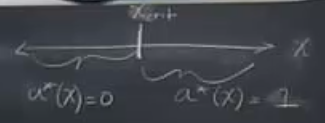

# Session 14

In the example which was presented in the previous session, suppose we have historical data. 

Suppose we know the true average and standard deviation. Suppose we have 20 historical data points. 
It is limited data.

In the above graph, you might think that the estimated average is higher than the actual average.

The estimated average and standard deviation are quite higher than the actual ones. 

In this case, the decision maker who rely on this model is actually overestimating the risk.

Suppose you have a forecasting system,

Instead of relying on historical data, suppose that we have forecasting system. Also, suppose the system is bias and it tends to be low.

It is linear regression that looks at forecast against the observations.

Next, we are going to figure out if you have the furcating system available, then what is the value of this forecasting system in providing information and delivering better decision.

$y_{1},y_{2},...,y_{n}$     historic observations

$x_{1},x_{2},...,x_{n}$     historic forecasts

#### 1- Estimate the model without the forecast

$y_{i}=\theta+\varepsilon_{i}$

$\hat{\theta}=\frac{\sumy_{i}}{n}=\bar{y}$

$\hat{\varepsilon_{i}}=y_{i}-\bar{y}$

$s^{2}=\frac{\sum(\varepsilon^{2}_{i})}{n-1}$

$Y_{n+1}=N(\hat{\theta},s^{2})$

$E[L(Y|a=no insurance)|\hat{\theta},s^{2}]=E.L.$

$E.L.\ge cost of insurrance$

Here, $\hat{\theta},s^{2}$ estimated with error. Therefore, If you do not handle them properly, you will get the error wrong.

If your model mis-specifies the original data generative process, you will also have the mis-specification of your actual risk and it may lead to the wrong decision. 

living with some kind of mis-specification might be fine depend on the application.

#### 2- Estimate w/ forecasts, what is the expected value of information?

This is going to ask how much better your decision is going to be if you actually have a predictive model that helps inform the decision. It might have some signal that may be is not perfect because it is only information. Then, on average how much loss you avoid compare to if you made otherwise the same decision-making process but without the predictive model. The information is valuable if it leads you to the different decision that you would not have mad otherwise. 

IF you have a forecast, the forecast depends on the signal you may receive. Therefore,

$a^{*}=a^{*}(x)$

How to use the forecast?

Method:

$y_{i}=\beta_{0}+\beta_{1}x_{i}+u_{i}$   $u_{i}\sim N(0, \gamma^{2})$ i.i.d

Use OLS (or your preferred technique) to estimate parameters

You can use the maximum likelihood here, too. It will give you the bias estimator that has smaller variance.

estimate \hat{\beta_{0}},\hat{\beta_{1}}, \hat{\gamma^{2}}

Generate the predictive distribution of Y|X. 

Suppose we make the best linear fit. Then, we have now condition information for the given y's and therefore with some estimate of distribution, you can map that distribution to the distribution of the losses.  The loss distribution will have the heavy weight on zero and then increasingly less and less weight on higher levels of loss. If there is minimum threshold, all of the values before the threshold in the first graph (normal distribution) will map to loss equal to zero and above that they all map to higher and higher losses but with less and less probability. here, we do not have any forecasting information. 

But the idea here is instead you got the forecast, so then you can for some given x value, the distribution of the Y|x is much sharper. Then, you can map that conditional distribution. The conditional distribution will have again heavy weight on zero but much sharper estimate compares to the previous graph. 

Then given the above distribution of loss, 

E[L(Y|X)]=E.L.(x)

For any given x,

Let $a^{*}(x)=argmin {E.L.(x),C_{0}}$

How much value does this created by refining the prediction system in this way? How you quantify that additional value?

Suppose we got the forecast and when the forecast is high buy the insurance. when the forecast is low do not buy the insurance. There is a critical boundary. I know in advance which x, I am going to map to which action. On the right part the expectation loss is higher than buying the insurance and the left part the expected loss is lower than buying the insurance.

To document how much value our method will create we can use the historic data. We can compare the action they actually did with how well we claim that could have done. That is one way to do that. 

We can obtain the expectation loss over the distribution of the forecast signal x and then compare it with loss which was obtained without considering forecasting signal. In the calculating the value of the loss without considering forecasting signal, it does not depend on x. 

