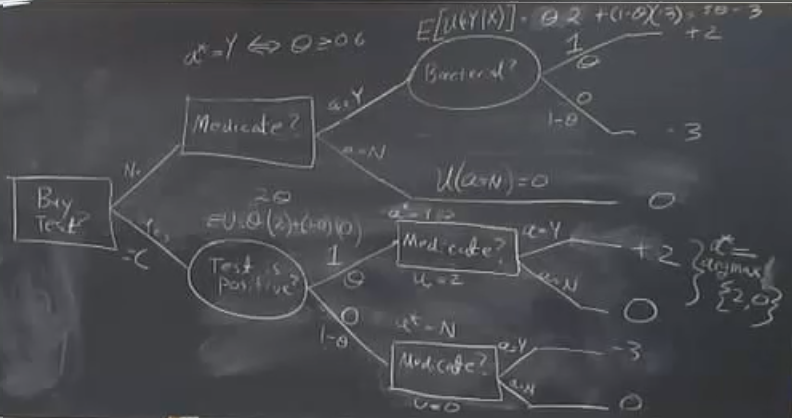

# Session 2:

## Notations

x: Random variables     $x \in X$

Example: X={Infection is bacterial, infection is viral}={0,1}

$\theta$: Parameters, unobserved. It describes our knowledge or beliefs about the probabilities of different x.

$\theta= prob{X=1} $

Example: $\theta=[0,1]$

$\pi(\theta)$ represents our knowledge our belief about $\theta$

$\pi(\theta)$: Somme probability distribution over $\theta$

$\Theta$: Parameter space

## Example:

x \in X={0,1} corresponding to whether or not the patient has or does not have a bacterial infection as opposed to viral.

 $\theta=[0,1]$  represents prob{x=1}
 
 Actions={Giving the medication to the patient or not}
 
 
 |               | 0             |      1       | Average      |
 | ------------- | ------------- |------------- |------------- |
 |       Yes     | -3            |2             |    1         |
 |       No      | 0             |0             |    0         |

Let present the same payoff in the decision tree. We represent the decision problem imagining you are going from left to right, and as you go you are making choices.

Here we represent our action or decision with the rectangular boxes. There are two choices whether or not to give the patient the medicine. If we give the medicine and the patient has a bacterial infection then the payoff will be equal to +2. On the other hand, if we give the medicine to the patient and the patient has a viral infection, then the payoff will be equal to -3. In the following decision tree, the $\theta$ shows our belief corresponding to the random variable value. If we do not give the patient the medicine the amount of the payoff will be equal to zero.

To solve the decision tree means to identify the optimal action to take that maximizes the payoff. In this case, the decision-maker is supposed to be risk-neutral. If the decision-maker is risk-averse, the decision-maker does not want to make a mistake. Therefore, he always decides not to give medicine to the patient to avoid payoff "-3". 

 
For each action in the decision tree, the amount of expected payoff was calculated showed in the above figure. The question is which one of the actions should be chosen. As it was shown, the action "Y" will be chosen if the expected payoff action "Y" is bigger than action "N" and vice versa. In other words, based on the math, if $\theta$ is bigger than 0.6, the action "Y" will be chosen.

Suppose there is a test in advance and the result of the test shows the exact value for the x. Here, the question is how much you will pay for the test. 

Suppose that we have a prior decision node and there is no probability for this branch since it is a decision node. The outputs of this decision node "Buy test" are "No" and "Yes". In the case of "Yes", we have an oval "test is positive" which means nature decides but the idea is, we get to learn that decision, that outcome before we have to commit to our action. So, in this branch, we first need to resolve uncertainty, and then we have to make a decision. We want to optimize our decision. The outputs of the node "test is positive" are "1" as positive and "0" as negative but what are their probabilities. If your beliefs about the test were rational, then these probabilities or beliefs must be consistent with the beliefs about whether or not it is a bacterial infection ($\theta$). That is more important when the test is not perfect and it has so much information. Then, we have to think a little bit deeper about it and we have to find the relationship between the result of the test and the result of the underlying process (where or not it is a bacterial infection).
However, here we assumed that the test is perfect and the result is consistent.
After coming out with the result, there is still a decision which we have to make. Here, we make choices condition on the outcomes. You may notice that if the test is imperfect, we will have to have another chance node after the decision nodes to represent the actual realization of the actual information. Here, it is not a case and the test is perfect.

The optimal actions:

If x=1 and $ a^{*}=argmax{u(a/x=1)}$

optimal action: $a^{*}=Y   since  $u(a=Y/x=1)=2$

If x=0 and $ a^{*}=argmax{u(a/x=0)}$

optimal action: $a^{*}=N   since  $u(a=Y/x=0)=0$

So, the question is should we buy the test or not?
To decide we need to know the cost of the test and its benefits. If the cost is less than its benefits, we will decide to go for the test.

In the decision tree, if the result of the test is positive, the payoff will be 2 (u=2). On the other hand, if the result of the test is negative, the payoff will be 0 (u=0). As a result, the expected payoff will be $E[u]=\theta \times 2+(1-\theta) \times 0$.

Now, suppose the cost of the test is equal to C. The question is whether or not we should buy the test. The amounts of payoffs are shown in the following figure.

** If we do not buy the test. **

If $\theta     \geq 0.6$

$a^{*}=Y   since  $E[u(a^{*})]=5 \theta -3$

If $\theta < 0.6$

$a^{*}=N   since  $E[u(a^{*})]=0$

** If we do run the test: **

$E[u(a^{*})]=2 \theta -C$

Should we buy the test? it depends on C and $\theta$

** $Test \lsim Do not     \iff$ **

1- In the case $\theta     \geq 0.6$,

   $2 \theta -C \geq 5 \theta -3$ 
  
2- In the case $\theta < 0.6$,

$2 \theta -C \geq 0$

ٌThe difference between the two above cases is called the Expected value Information.

$ \theta -C \geq 0.6$ \Rightarrow V=2 \theta - (5 \theta -3)$ 

$\theta < 0.6 \Rightarrow V=2 \theta$

Decision: buy the test if V>C

