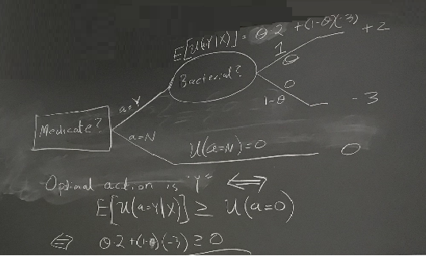
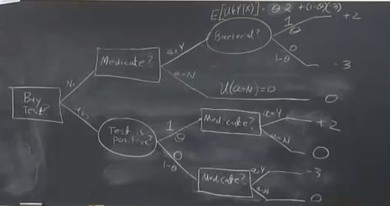

# Session 2:

## Notations

x: Random variables     $x \in X$

Example: X={Infection is bacterial, infection is viral}={0,1}

$\theta$: Parameters, ounobserved. It describes our knowledge or beliefs about probabilitys of different x.

$\theta= prob{X=1} $

Example: $\theta=[0,1]$

$\pi(\theta)$ represents our knowledge our belief about $\theta$

$\pi(\theta)$: Somme probability distribution over $\theta$

$\Theta$: Parameter space

## Example:

x \in X={0,1} corresponding to whether or not the petient has or does not have a bacterial infection as oppose to viral.

 $\theta=[0,1]$  represents prob{x=1}
 
 Actions={Giving the medication to the petient or not}
 
 
 |               | 0             |      1       | Average      |
 | ------------- | ------------- |------------- |------------- |
 |       Yes     | -3            |2             |    1         |
 |       No      | 0             |0             |    0         |

Let present the same payoff in decision tree. We represent the decision problem imaginig you are going from lef to right, and as you go you are making choices.

Here we represents our action or decision with the rectangular boxes. There are two choices whether or not give the petient the medicine. If we give the medicine and the pecient has bacterial infection then the payoff will be equal to +2. On the other hand, if we give the medicine to the petient and the petient has the viral infection, then the payoff will be equal to -3. In the following decision tree, the $\theta$ shows our belief corresponding to the random variable value. If we do not give the petient the medicine the amount of the payoff will be equal to zero.

To solve the decision tree means to identify the optimal action to take that maximizes the payoff. In this case, the decision maker is supposed to be risk neutral. If the decision maker is risk averse, the decision maker does not want to make mistake. Therefore, he always decides  not to give medicine to the petient to avoide patoff "-3". 

 
For each action in the decision tree, the amount of expected payoff was claculated showed in the above figure. The question is which one of the action should be choosen. As it was shown, the action "Y" will be choosen if the expected payoff action "Y" is bigger than action "N" and vice versa. In other word, based on the math, if $\theta$ is bigger that 0.6, the action "Y" will be choosen.

Suppose there is a test in advance and the result of the test showes the exact value for the x. Here, the question is how much you will pay for the test. 

Suppose that we have prior decision node and there is not probability for this brach since it is a decision node. The outputs of this decision node "Buy test" are "No" and "Yes". In the case of "Yes", we have oval "test is positive" as which means the nature decides but the idea is we get to learn that decision, that outcome before we haveto commit to our action. So, in this branch we first need to resolve uncertainty and then we have to make a decision. We want to uptimize our decision. The outputs of the node "test is positive" are "1" as positive and "0" as negative but what are their probabilities. If your beliefs about the test were rational, then these probability or beliefs must be conssistent with the beliefs about whether or not it is bacterial infection ($\theta$). That is more important when the test is not perfect and it has so many information. Then, we have to think a little bit deeply about it and we have to find the relatioship between the result of the test and the result of underlying process (where or not it is bacterial infection).
However, here we assumed that the test is perfect and the result are conssistent.
After comming out the result, there is still a decision which we have to make. Here, we make choices condiyion on the outcomes. You may notice that if the test is imperfect, we will have to have another chance node after the decision nodes to represent the actual realization of the actual information. Here, it is not a case and the test is perfect.

