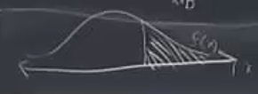
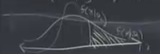
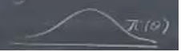

# Session 5

In the previous example "When should I leave my house to get to the airport", we do not use directly the estimated value, because there is an uncertainty and error in estimation how long it will to take you to get to the airport. The cost of the error is not symmetric; it will cost you a lot more to be a little bit late than to be a little bit early there. Therefore, your optimal action, should take that estimation error into account. You choose the action that maximazes payoff in estimation rather than the estimate of unobserved parameter and then, plug that into the decision making formula, assuming it is correct, ignoring the error and then make an action based on that assumption (estimated value).

Here, We need to quantify the amount of the error (uncertainty) and take inti account to make a rigorous optimal decision. This is why the statistical decision theory is a powerful tool because it gives you the rigorous way to deal with the error.

Actions: $a \in A$

States: $x \in X$, Parameters: $\theta \in \Theta$

$x_{1},x_{2},...,x_{n}$ random variables on X

Suppose we have uncertainty about our parameter values and in our game directly or indirectly we are depends on the values of the unobserved parameters.

So, we suppose that we got some posibility to get better information about unobserved parameters and there can be different ways.  Here, we suppose we are going to get information by using statistical sampling from the state space and the statistical inference.

EX: Who is going to win the election and it depends on the population. Therefore, you can learn by doing some statistical smapling and from that you can get information.

When we are doing sampling, we suppose that they are independent and identically distributed (iid).

f(x): Defines the probability distribution for all $x_{i}$ (for now drop i)

If X is discrete, e.g. X={1,...,m}

$f(x_{j})=pr{X=x_{j}}, j=1,2,...,J$

More generality, $B\subseteq X$

Then, $pr{x\subseteq B}=\Sigma_{j\in B}f(x_{j}) j=1,2,...,J$

If X is contineous

$B\subseteq X$

Then, $pr{x\subseteq B}=\int_{x\in B}f(x)dx $

Suppose that there are probability density depends on the values of the unobserved parameter ($\theta$), e.g. If we belive that the values are normally distributed, then it depends on two parameters including the $\mu$ and $\sigma$ of the distribution. 

$f(x)=f(x\\theta)$

Ex: $x_{1},x_{2},...,x_{n}\sim N(\mu,\sigma)$

$\theta=<\mu,\sigma^{2}>$

Let $\pi(\theta)$ denotes our prior believs about values of $\theta$

We are going to use any kind of predictive model or tool to sharpen or probabilirt distribution over the state variables as it was shown in the below figure. in this way we would have more confidence when we choose an action. 

Suppose we have a loss function that depends on $\theta$: $L(a,\theta}$

Suppose we know exactly what $\theta$ is, then choosing optimal $a^{*}$ is trivial.

$a^{*}$ =arg max L(a\\theta)

more generally suppose our belifs about $\theta$ reprsentated by $\pi(\theta)$

Then, for each action $a \in A$, $L(a\\theta) is a random variable. When you choose an action, you are choosing in effect the lottery, and then depending on $\theta$, you will realize some loss.

Depending on true value of $\theta$, get some realize 

Expected loss, given beliefs $\pi(\theta)$ 

$E[L(a\\theta)]=\int_{\theta\in\Theta}L(a\\theta)\pi(\theta)d\theta$

EX: The airport departure decision: if you have the suppose that $\theta$ governs how long is going to take you to get to the airport in the likelihood of the plane is late or other things; a is how early you decide to leave. Then, when you choose the actiob (when you are going to leave), given the beliefs you have the expected pay off that includes all of the probabilities over your beliefs about $\theta$.

$\theta$: The time your plane leaves. HOw long you wil need.

$\pi(\theta)$: your beliefs about $\theta$

a: how long you give yourself 

\begin{equation}
  L(a\\theta) =
    \begin{cases}
      C(a-\theta) & \text{if $a\ge\theta$ }\\
      1000 & \text{if $a\le\theta$ }
    \end{cases}       
\end{equation}

C: How much you value your time ($/hr)

$E^{\pi}[L(a\\theta)]=\int L(a\\theta)\pi(\theta)d\theta$

If $\pi(\theta)\sim N(\mu,\sigma^{2}_{\theta})$

Then, $E^{\pi}[L(a\\theta)]=\int L(a\\theta)e^{-\frac{(a-\mu_{\theta})^2}{\sigma_{\theta}}}$

We think $\mu_{\theta}$ is the most likelihood $\theta$. 

We keep our example simple and we suppose that there is just only early and late. You leave early or not and you hot a traffic or not. So, you have two by two decision and if you are early you waste your time and if you are late you miss the flight. In that case, this problem looks very much like our problem about giving the meditation to the patient. 

The point is , you do not assume that $\theta=E[\theta]=\int\pi(\theta)d\theta=\mu_{\theta}$

and then solve $min[L(a\\mu_{\theta})]$

Instead, $min E^{\pi}[L(a\\theta)]$

In general, 

We assume the most likely is to leave the house 1.5 hour before our flight. So, we optimize 

