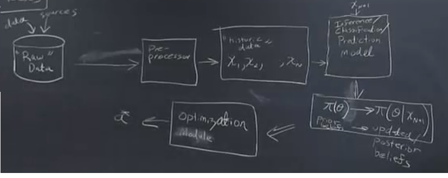

# Session 6

### Big picture: How to make optimal choices under statistical uncertainty?

 * A decision-maker (a.k.a. *actor*) chooses one option from a menu of possible *actions*.
 * Payoffs from that choice depend on the action chosen, and on the *true* value of the state of nature.  Depending on the way we are modeling,
   the true state of the nature could either be unobservable realized radom variable x or could be the value of the unobserved parameters but in either way we call it the state of the nature.
      
   - Payoffs may equivalently be represented as *losses* --- negative payoffs relative to some baseline.
   
 * The true value of the state of nature is *uncertain*. Hence the decision-maker confronts a problem of *decision-making under uncertainty*. 
   
   - Each possible action thus maps to a *lottery* over uncertain payoffs.
   
 ### Uncertainty
 
 * Typically, the decision-maker will posses some information about the likelihood of different states of nature. 
 
 * This information can be represented formally by treating the state of nature as a random variable drawn from a known distribution. 
 The tricks here is try to represent those distribution formally, so we have a quantify handle on what we know and what we do not know. Then, those quantify
 representation of the uncertainty in the optimize way.
 
 
 ### Optimal choice

 * Given a complete enumeration of 
   - the menu of possible actions, (a)
   - the set of possible states of nature ($\theta$), 
   - a probability distribution over the set of states of nature, representing the likelihood of states, and
   -- a *payoff function* that gives the payoffs (or losses) from each possible combination of action $\times$ state, in some units of measure.
   
   then each possible action maps to a *lottery* over payoffs (losses).
   
   ### Optimization: Defining objectives

 * Finally, given a lottery over payoffs, the actor chooses an *optimal* action guided by a *decision-making principle*:
 
   - *Example:* Maximize expected payoffs.
   - *Example:* Maximize expected utility of payoffs.
   - *Example:* 'Minimax': Choose the action to minimize possible loss, irrespective of probabilities. (extreme form of risk aversion)
 
 * The decision-making principle encodes the actor's attitude towards risk -- the willingness to accept losses in some uncertain states of the world, in exchange for acheiving gains in other states of the world.
    - The study of attitudes towards risk and loss is huge topic in economics, finance, and psychology. We will cover it only glancingingly.
    - For your applications, just at minimum be aware that the actor's optimum choices may not be driven by goal to maximize expected gains (= minimize expected losses). 
   
 Definning the objective function is not trivial. Depending on your application you may have very clear objective or you may not have  aclear set of objectives.
 
 After modeling your problem, you will have a set of actions, their payoffs and corresponding probabilitie. Now, what you should do? Which option would be best.
 
You have to have some principles for converting lotteries over payoffs into an optimal choice. There are different ways to do this, one of the ways is maximization expectation payoffs. Have it in your mind that when you have uncertianty you should not collapse the uncertainty, and then consider expected value. 
 
Ex (Flight): We were consulting to the atmospheric scientists and they had planes that could fly arround and collect data. Part of the challenge was the amount of the flight and the number of the days in a season were restricted. They did not just have one decison about where to go. THey had three possible options. There was a menue of choices instead of yes/no. There were including 1) Flight in zone one, 2) Flight in zone two, 3) Flight in zone three, or do not fly. The trick was what they care about it at the end of the season was what portfolio of the data did they have. What they wanted was the more data is better but they also wanted the more balanced data. They wanted data with nearlly the same portion from all three zones. So, we had to extract from them what was the utility function. How much would they care about the balancing the portfolio? How much more data would they give up to have more balance data? The atmospheric scientists did not know what is the utility function. We had to go find their preferences in this process to get enough information about how to make this trade off. Then, we used the utility function as an objective function. In those case, the goal is not just maximiza as much data as possible but they also want the balaance portfolio. In this application we need to think about the shape of the utility function.
 
### Integrating predictive and inferential tools into the decision calculus

In general, your predictive model serves to *reduce uncertainty* over future values of the states of nature.

They *sharpen the probability distribution* over states of nature.

(In terms of probability theory: they involve a *change of measure*.)

The actor can now choose an optimal action based not on her *prior* (or *naive*) beliefs, but on her *posterior* beliefs, conditioned on the current data.
   
### Payoff functions: Define in terms of $x$ (state) or $\theta$ (parameter value)?

Depending on your appplication, it may make sense to model payoffs (or losses) as either a function of observed realized state $x \in \mathbb{X}$, e.g., $x$ denotes realized temperature:

$$L_0 = L_0(a;x)$$

or in terms of the value of an unobserved parameter, e.g., $\theta$ denotes mean temperature:

$$L_1 = L_1(a; \theta)$$

Ex: Suppose you are going to think about how much you are spending on energy or fuel tommorrow. For example you want to decide how to set the thermostat and your losses is based on your expenditure and your comfort. Depending on how your dicision making problem is set up, it makes sense to represent that explicitly in terms of your on realized observable temprature or it could make sense to think about it in terms of unobserved parameters of the model.

In the example flight x was for eachday in the field season, there is a reallization either the condition is good for data collection or not. The action in that case is either fly on that day or not. So, $\theta$ will describe the likelihood of the good or badconditions but at the end of the field season what the decision maker cared about is not the likelihood, thwy cared about how much data they actually got.based these, the loss is explicitly based on the reallized outcomes.

### Parameter-dependent payoffs as reduced form of state-dependent payoffs

In many cases, you can represent the $\theta$ formulation as the *reduced form* of the $x$ formulation, e.g.

$$L_1(a;\theta) = E[L_0(a;X) | \theta]$$

Ex: If X is a random variable and the distribution over X governs by $\theta$. So, a realization is a draw from the distribution and the parameters. 

Ex: You are going to do fraud detection. You have financial transaction come to the system. The computer has to very quickly identify the liklihood if the transaction is fraud or not. You have a lot of data and small percentage of them are likelihood probabilty and the action is whether or not flag that transaction and give it more screening by human analyst. 

### Building and Running a decision rule:

1- Building and calibrating the tools

2- Put into the production

There is a raw data and preprocessing will be done on them. The output wil be the structured data, which is a data in terms which youcan actually use. You use the structured data to callibrate your model. What it allows you to do is to get a new input data and map your prior beliefs to the posterior believs about the data. Then, given your posterior beliefs, the output of the optimization model will be the optimal choice. 

Intertemporal optimization: It is for set of approches for dealing cases, in which we have a set of copies of decisions and they have impact on each other. 
