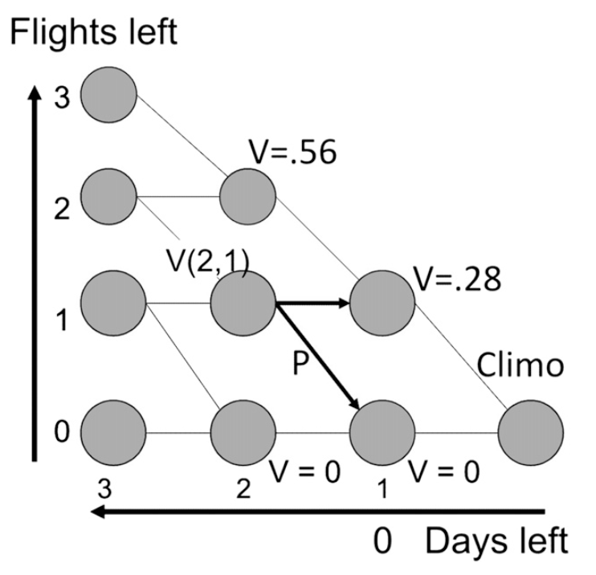

# Session 7

## The Cloud Hunter's Problem

There were clients here who were atmosphoric scientists. They had limited budget, which is the flight hours. In order to collect data, they have to fly a plane into the certain type of the clouds. In this application they were looking for the boundry layers. The Cloud Hunter wants to collect data from inside *liquid boundary layer clouds*. They were looking for particular atmosphoric conditions and they have to make their decisions about when and where they wanted to make their plane fly. They do not know in advance that where or not they are going to get the conditions that they are looking for that are suitable for data collection for the kinds of the program they had in their mind. 
The Cloud Hunter’s Problem concerns how to allocate a fixed budget of flight hours between dates over the course of a field season. 

Fly/No-fly decisions must be made 1 day ahead, based on imperfect day-ahead forecasts of whether conditions are good or bad for collecting required data.

To solve this problem, traditionally the decision making process features a lot of atmosphoric scientists sitting arround the table and looking at the maps of the forcasts and argueing with each other. In that situation, they got tons of the forcasts and discuss it with each other. they may not have done a bad job about figuring out what is the probability of the having good weather tommorrow. However, they may not have been good at 
figuring out what is the opportunity cost of using up some of the flight hours from the budget. They may risk and  used up the flight in the bad condithions and there is some cost in terms of less optionality to take advantage of possibly more promissing conditions later in the field season. The brain cannot do dynamic optimization and statistical process.

## Formal model of the Cloud Hunter's decision problem

### Model setup: Conditions for data collection over the course of the field season

$D$ : length of the field season in days

$d = D, \ldots, 1$ : index of dates (we think of d as how many days we have left rather that counting from start of the field season forward)

$X_d$ : quality of conditions for data collection: 

 * $X_d = 1$ if conditions on date $d$ are good, 0 otherwise
 * Each $X_d$ a binary random state variable, i.e., a Bernoulli trial

A field season is a particular realization $x_D, \ldots, x_1$ of the stochastic process 
$X_D,\ldots, X_1$.

Will assume the $X_d$ are independent and identically distributed (i.i.d.). 

 * Assumption not actually required, but keeps things simpler and clearer.

Vector notation: $\bf{X} =$$< X_D, \ldots, X_1>$ denotes the stochastic process; $\bf{x} =$$< x_D, \ldots, x_1>$ denotes a particular realization.

### Model setup: Decisions, resource constraints

$F \leq D$ : number of flights in the Cloud Hunter’s budget. 

$f = F, \ldots, 1$ : index of flights remaining in budget

$a_d$ :  binary control variables ("actions")

* $a_d = 1$ iff they opt to fly on date $d$, 0 otherwise

$\bf{a} =$$< a_D, \ldots, a_1>$ : actions chosen on dates $d = D, \ldots, 1$

Resource constraint: $\sum_d a_d \leq F$.

(Assume flights left over at the end of the season have no residual value.)

### Payoffs and objectives

*Payoffs*: For a given sequence of choices $\bf{a}$ and realizations $\bf{x}$, the realized amount of data collected $U$ is given by 
$$U = \mathbf{a \cdot x} =\sum_d a_d x_d$$.

*Decision-maker's objective*: Choose a fly/no-fly decision rule to maximize data collected in expection, subject to the resource constraint on total allowable flights:

Choose $\bf{a}$ to $max_{\bf{a}} = E[\bf{a} \cdot \bf{X}]$, subject to $\sum_d a_d \leq F$.

\textbf{Important:} This is a *substantive assumption* about the decision-maker's goals.

  * Models a decision-maker with a high tolerance for *risk*. 

### Forecasts

Give we have a forcasting system and it delivers us a set of singnals instead of forcasts which you should believe and take literally. THese signals are not the output of the weathe prediction model. We just consider it somehow correlated with the process which we care about. We do not take literally what the signal says, instead we map this signal to the probability distribution based on our experience or understanding of the signaling system. Your job is to decode the dignal and you should find out how to map the given signal to the probability distribution over the state of the word. 

Everyday, here, atmosphoric scientists got forcasting signal and it drawn from some set of possible signals. Given that signal, we have some  way to convert that signal to probability of a certain day. When we figure out how that mapping works, we no longer care about any of the stuff that went into to make the mapping. We treat it as a converter that converts the signal to the probability.

Decision taken on basis of a day-ahead forecast.

Before taking each decision, decision-maker receives a forecast signal $s_d \in \mathbb{S}$.

Calibration: map this signal to a probability of good conditions:

$$p(s) =  \Pr\{X_d = 1 | s_d = s\}$$.

(Will assume stationarity.)

In general, in each day you got a signal and calculated the probability corresponing having a good condition in the next day. You did not know anything about the probability of the days beyond tomorrow. 

### Distribution of forecast signals

More than one day ahead, don't know which forecast signals $s \in \mathbb{S}$ will be received.

But, *do* know the the likelihood of receiving different signals.

$\pi(s)$ : probability that forecasting system will generate signal $s$. 

$\pi(\cdot)$ defines a probability distribution over the set $\mathbb{S}$ of possible forecast signals.

### The task of the decision analyst

Given this set-up, the job of the decision analyst is to devise an *optimal decision rule* $a^* = a(d,f |p)$ that delivers a recommended action---fly or no-fly---as a function of 

 * $d$ the number of days left in the field season, 
 * $f$ the number of flights left in the budget, and 
 * $p(s)$ the forecast probability that a flight today would be successful.
 
A decision rule $a(\cdot)$ is deemed optimal if its consistent application maximizes in expectation the yield of successful flights realized from a given budget $F$.

 

### Comment

This is a challenge of *intertemporal optimization*: each choice $a_d$ alters the expected payoffs for subsequent decisions. 

Need to use tools of optimization that account for this intertemporal structure.

*Dynamic programming* turns out to be the right tool for the job.

## Optimization via dynamic programming

### Intertemporal optimization via dynamic programming

Basic idea: break the decision problem into two pieces: (i) the next day's decision, and (ii) the rest of the field season after that.

Assume you've got the right answer (!). Given that this answer is optimal, derive the properties that solution must have.

Solve via backward induction.

$< x_D, \ldots, x_1>$    random variable of states  $X \in {0,1}^{D}$
$a = < a_D, \ldots, a_1>$    choices    $a \in {0,1}^{D}$

#### Decision problem

We have as much data to make the expectation.

$ max_{a} E[a.X] $

We want to choose sequence of the actions that maximizes the above objective function.

Successes are flights launched on days with good conditions. If we fly the plane on he day that the condintion of the weather is not good it is not a success. Beside, if we do not fly the plane on the day that the condition is good is not success to. 

Each day we get signals: $s_{D}.s_{D-1},\ldots, s_{1}\in S$   Forcast signals

We have a calibrated fuction that maps the signal

$p(s)=pr{X_{d}|s_{d}=s}$

How it works:

Suppose 10 days left in the field season. We have three forcast in our budget. The forcast says that there 30 percent chance that tommorrow is going to be a good condition. Should we go for it? To solve this case think of the simpler version of this case. Instead of thinking there are ten days left, consider there is only one day left and you have one flight left in your budget, you will fly your plane. On the other hand, consider there is only one day left and you have no flight left in your budget, you won't fly your plane. In this case, having only one day left, there is no decision to make.Consider two days left, and there is only one fligt left. Now, we have real decision. We have forcast signal only for one day ahead ($s_{d}$). For two days ahead, $S_{d}$ is a random forcast signal with probability distribution $\pi(.)$

S={1,2,...,24} are the forcasting signals that we may get. For example, for tommorrow we get one of these signal and when we get it we are able to convert it to the probability. 

Case: d=2 and f=1

We know $s_{2}$, therefore $p(s_{d})=Pr{X_{d}=1|s_{d}}$

We know $s_{1}$ will take one of the 24 values, and how likely each is.

Our goal is to maximie the objective function. We know based on what we do today, we already know what we are going to do tomorrow. If we fly today, by how much in expectation we will increase our toatal take? If we fly today what would be the expected marginal increase? 

Suppose we have now 29 successes, Suppose $a_{2}=1$

U: number of the successes at the end of the season

If $x_{2}=1$, U=30

$x_{1}=0$, U=29

so, if $a_{2}=1$ (i.e. we fly today)

Then E[U]=29+$p(s_{2})$(1)+$1-p(s_{2})$(0)=29+$p(s_{2})$

We wanted to maximize the expected value.

So, $E[U|a_{2}=1]=29+p(s_{2})$

$E[U|a_{2}=0]=29+E[a_{1}.x_{1}|a_{1}=1]$(since $a_{2}=0$ then $a_{1}=1$)

$=E^{x}[p(s)]=\pi(S=s_{1})Pr{x_{1}=1|s_{1}=1}+\pi(S=s_{2})Pr{x_{1}=1|s_{2}=1}$+...

$\Sigma\pi(s).p(s)=E^{\pi}[p(s)]$

So, Should you fly today or not. We choose to fly today if "29+$p(s_{2})$" is greater then $E^{\pi}[p(s)]$.

So, we choose $a_{2}$ iff $p(s_{2})	\ge E^{\pi}[p(s)]$

Let $a^{*}_{2}$ denote the optimal choice

Let $v(2,1)=E[U|a_{2}=a^{*}_{2}]

=29+$max{p(s_{2}), E^{\pi}[p(s)]}$

You will solve this through backward induction.

