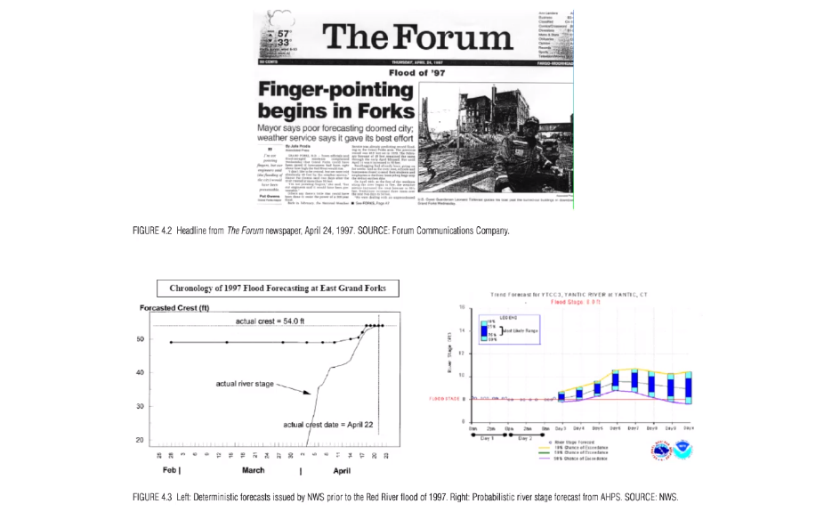

# Session 8

There is a report called "Completing the forcast". When we produce a forcast, of course, there is an error. What we can do is see if we can actually represent the error in our forcast, in a rigorous way. The weather system is a cheotic system which implies something in feature called sensitive dependence on initial conditions. IT means if you misspicify your initiale condition by just a little bit, then as you forcast over time, evenif you have the physics completely accurate, that small error in the way you specify the correct state of the system will will inevitably lead to larger errors over time. Those errors do not grow linearly with time; they explode. This error is inevitable, since you can not completely specify the state of the atmosphere. Even thoug you could do that accurately, there is not enough sensor. Let's represent our actual uncertainty about the forcasting. With different initial condition, you get different model runs comming out and then you measure the uncertainty in the forcast based on those models.

There was a flood in Red River in Grand Forks in 1997. They had prepared for the flood because they were getting forcast from Natural weather servise about how high river would rise. Then, they estimated how hight the flood would go and gave the expected value. They forcasted the rivers only got up to "50 ft". Therefore, they decided to make sand bags and they thought if the hight of the sand bags were 50 ft, they would be safe. But, they did not. The forcast and the actual rising were shown in the graph. What happen was it bumped up the forcast very fast and there was not enough time left to increase the hight of the sand bags. Therefore, there were a lot of blames that the Natural weather servise did poor job. It was not actually fair, because they gave the best forcast best on the data. The problem was that expected value is not the infrmation that they needed. They needed the information about how high the sand bag should be. They did not to know the best estimation for sand bags, they needed to know what is the probability of getting higher than 50 ft, 51 ft and so on. When they had that information, they could have themselves calibrated how much risk they were willing to take. It was turn out that the Natural weather servise, they actually had that kind of theinformation but nobody ask them to produce that. They found ou that the 54 ft was within the reasonable margin of the error goven the analatics they were using. The left side graph was that kind of information thay have started to produce since that event. In this graph, the green line shows the expected value and the blue boxes show the amount of the error. 

Right bottom circle is the end of the season. At that time, we would be out of the season and out of the flight. Therefore, the expected flight for rest of the season would be zero. In addition, for all of the bottom circles, the expected value again would be zero. On the circle corresponding one day left and one flight left, the expected value would be 28. What would be the value of being at the circle corresponding to two days left and one flight left? We know there are two ways to reach to the end of the season. We will choose to go for one day left and no fligt if its likelihood is bigger than 0.28. So, in this way, you will go backward.

### 

Suppose an optimal decision rule $a(d, f | s)$ has been found. 

Let $V(d, f)$ denote the expected number of successes that would be realized from repeated application of this rule, starting from initial conditions $<d, f>$. 

By construction, $V(\cdot)$ equals the maximand of the decision-maker's objective function, beginning from these initial conditions, under the substitution $a = a(d, f | s)$:

$$V(d,f) = E^{\pi} \left[ \sum_{i = d,\ldots, 1} a(i,f_i | s_i) \cdot X_i \right]$$
where the expectation is taken over the probability distribution of all possible sequences of forecast signals (determined by $\pi$), and where $f_i$ denotes the number of flights remaining on date $i$ when the optimal program is followed.

###

$V(d,f)$ called the *value function* for this problem.

Because $a(\cdot)$ is assumed to be optimal, $V(\cdot)$ must satisfy a particular recursive relationship:
$$ V(d,f) = E^{\pi} \left[ a^*_d \cdot X_d  + V(d-1, f- a^*_d) \right]$$
where $a^*_d = a(d,f | s_d)$ is the optimal decision.
###
Once the forecast signal $s_d$ is received, $a^*$ will be chosen optimally:

  * If $a^* = 1$, then $V(d,f | s_d) = E \left[X_d | s_d \right]  + V(d-1, f- 1)$.
  * If $a^* = 0$, then $V(d,f | s_d) = V(d-1, f)$.

Since $V(\cdot)$ is by construction a maximum, we must have:
$$V(d,f | s_d) = \max \{ E \left[ X_d | s_d \right]  + V(d-1, f- 1), V(d-1, f) \}$$
               
$=  \max \{ p(s_d) + V(d-1, f- 1), V(d-1, f) \}$
               
###

This formula implies the optimal decision rule: $a^* = 1$ ("fly") only if

$$ p(s_d) \geq V(d-1, f) -V(d-1, f- 1)$$
i.e., when the expected payoff of the current day's opportunity exceeds the loss in marginal cost associated with arriving tomorrow with one fewer flight in the bank.

Call $p(s_d)$ the *hurdle probability*.

Successes are flights launched on days with good conditions. 

Type I errors are decisions to fly only to find no clouds.

Type II errors are decisions to stand down only to find that the desired conditions existed.
