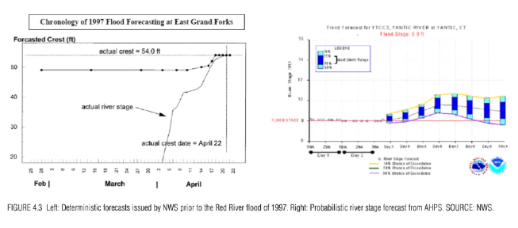
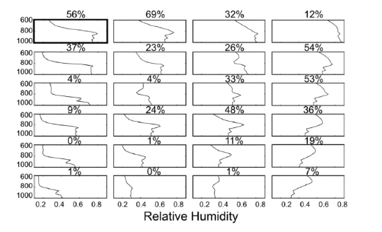
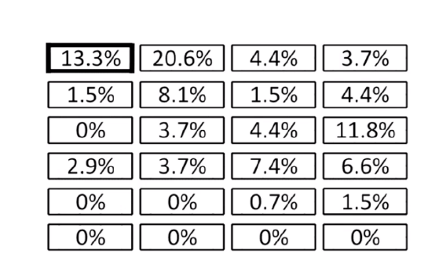
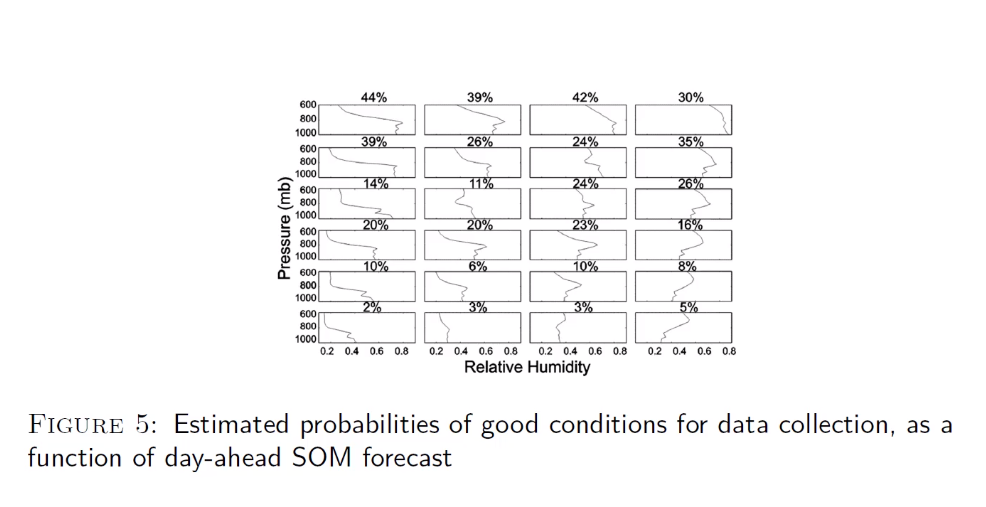
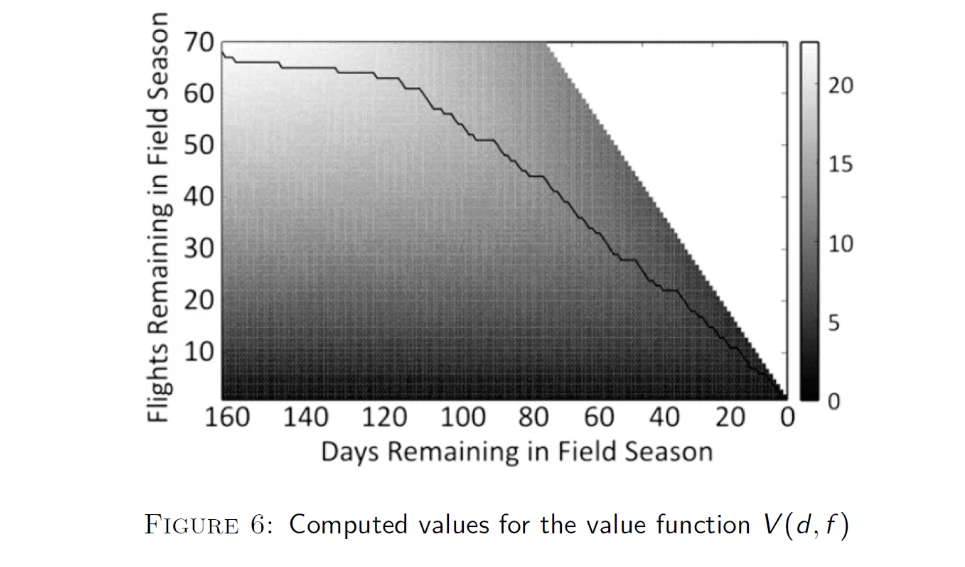
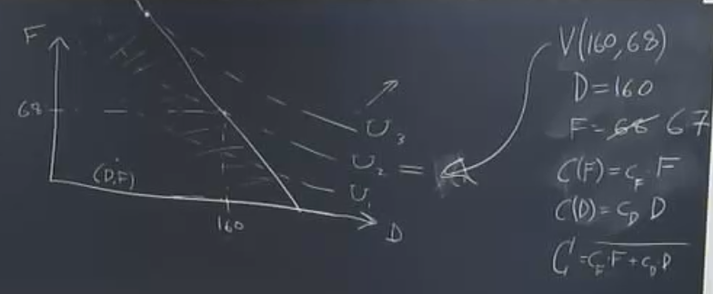
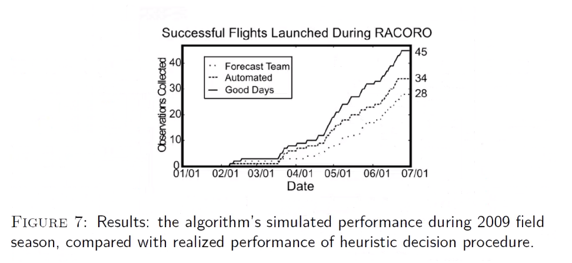
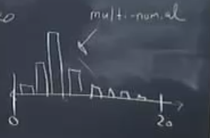

# Session 9:

Given we have a decision problem and a predictive tool that helps us to discriminate between different cases. Each decision-maker has a menu of the options and the values, and the predictive tool allows you to discriminate among cases. So, you can deliver the right introduction for that case. We also have the theme of handling the uncertainty. We want the forecast information to include information about uncertainty. The way to do this is to present a forecast as a probability distribution over the state relevant variance. So, to get that kind of information, we must create a specialized post processor that would convert the output of the predictive model into probability distributions over the relevant state variables. You may get some prediction in your case, but the form of these predictions may not be expressed in terms of the probabilities of the decision making variables. Therefore, in this case, you are going to have to construct that postprocessing tool. There are various tools to do forecasting and so on for us. How to translate those into the probability distribution for the particular variable that the decision-maker cares about, it is going to be an application-specific endeavor.  

 In the previous example, the forecaster delivered high-quality information about the wrong variable. The variable that is not the one that the decision-maker cared about. What the decision-maker cared about was the distribution of the probability, the probability of the exceeding different thresholds. Then, that gap in the graph led to the flooding the town.

How they got the probability distribution? There are many variables that scientists can measure, but they must work on relevant variables, which here is the relative humidity. There were too many relative humidity types, but we use methods to cluster them into 24 profiles. It is called dimensionality reduction. Given we have a relative humidity plot, and we want to check to which one of the profiles, it matches. To do this, we use the Euclidean distance. Then, the percentage above the corresponding relative humidity profile shows what percentage of the plots which are placed in this profile featured the boundary clouds. For example the number above the first profile (56%) shows that fifty six percent of the plots which match the first profile feature the boundary cloud.
Here, we did get discrimination, we get 24 different types. If we have the same number above all of the profiles, it is a failure. It does not matter, in which boxes your graph is located, you will get the same probability of getting the boundary clouds. Therefore, this mapping does not give you the discrimination, which is the whole point of your predictive tool. The goal of your predictive tool is to discriminate between different cases in a decision-relevant way.  We have different numbers; therefore, we have discrimination between them that is relevant to the reaction that we care about. If you have the perfect discriminator, it would be great.

What goes into this graph is not raw data? It is actually the output of the numerical weather prediction model. Here, the problem is the forecasting model has the error. We have a couple of different errors that we have to deal with. We have an error that given the relative humidity profiles, we got the imperfect of whether or not we are going to get the boundary level clouds. Then, given the forecast of the future atmosphere condition is also imperfect. So, we have to deal with both types of errors. 

The above picture is dealing with the second type of error. If you forecast the certain type of the relative humidity profile, how good is that forecast? Conditional on predicting that we end up the first state, what is the likelihood that we actually end up the first state? As it is shown in the picture is equal to 13.3%. If our forecasting system is perfect, then this number will be equal to 100%. If it is completely useless, the numbers for all states will be the same. There is no discrimination between them. 

Then we put both kinds of uncertainties together. Figure 2 is mapping from reality to what we care about. The below graph is the mapping from the forecast to what we care about.

If the model forecasts that we will end up the first state of the atmosphere. Then, 44% of the time, we will get the boundary clouds. So, we still here have discrimination. The numbers above each plot show the probability of getting boundary clouds conditional on the forecast, telling us the relative humidity profile looking kind of like them. 

p(x=1|SOM=1)=0.44

If the graph is completely uninformative, then:

$p(x=1|SOM=1)=p(x=1)=\beta$

The unconditional probability is equal to average frequency throughout the year of getting a boundary cloud.

Now we are going to use this framework for pre-season planning. So, you can predict before starting the field season in expectation at the end of the field season how many successful flights you are going to have. If you follow the rules, you can expect that the end of the field season. V(160,68) is going to be our expected pay off if you behave optimally. 

If you start from a point (D=160, F=68), you know what the probability distribution is over the likelihood outcome. If the number of flights decreases by one, you can still say what will be the probability distribution over the outcomes at the end of the season. Consider there is the cost for flight and cost for the day in the season. 

$C(F)=C_{F}F$

$C(F)=C_{D}D$

$C_{T}=C_{F}F+C_{D}D$

Based on them, we want to maximize the expected pay off under constraints of the budget.

The x-axis is the set of combinations of initial days in the field season.  the y-axis is the number of flights in the budget.  IF we have 100 days and 68 flights we will have the corresponding point on the curve $U_{1}$. You can have the same expected value by adding more days and reducing the number of flights because all of the points on the curve $U_{1}$ have the same expected value. 

Suppose given the prices, any combination on the left side of the line which crosses the curves is affordable. The points on the line have the cost equal to $C_{T}=C_{F}F+C_{D}D$. I want here as much data as possible in expectation and I want to give $C_{T}$ money. The graph tells me how much data should I expect at the end of the season for any combination of the day and flight. I want to maximize the expected data subject to constrain the total cost of the field season. As was mentioned, any combination on the left side of the line is affordable given the budget. Which combination would give me the most possible data? You should look for the highest curve U which the line cross. In other words, you should want to get the highest curve that you can while staying within the budget constraint. This point is located on a curve of $U_{3}$. This point gives us the most data expectation subject to the budget constraint.

The verification of your result is critical. What you really want to know is how much value your framework added. You should measure the value which is added quite vigorously. In this problem, we do not have a vigorous way of measuring, because we cannot know what would have happened without our predictive method. In this case for analytic purposes, we have a beneficial situation that we do know because the predictive model did not be used. Therefore, for that one field season, we actually know what they did without the predictive model and we can use that result for comparison. 

### Bayesian method

This is one of the ways which is used in the decision-making process. This approach used in a situation where there is not enough data or in a rare event. It is a statistical model that is trained on the data. I am used in situations where we have a limited amount of data and we do not want to over-rely on the data, because you recognize this is the small sample and it may not really reflect what is really going on. 

you want to estimate the fraction of a population that is infected with some disease.

Suppose $x_{1}, ... , x_{20}=0,1,iid, \sim Bernoulli (\theta)$

You want to estimate the value of the $\theta$

Prevalence of the infection in the general population

Test a random sample of $20$ from the population. 

$Y= \sigma x_{1}+ ... +x_{20}$ 

For each i=1,...,20,$Pr(x_{i}=1)=\theta$

For y=1,...,20,$Pr(Y=y)=?$

Y follows the multi binomial distribution. 

